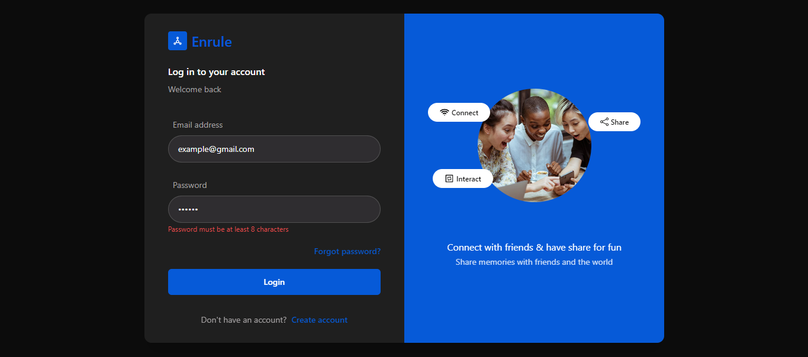
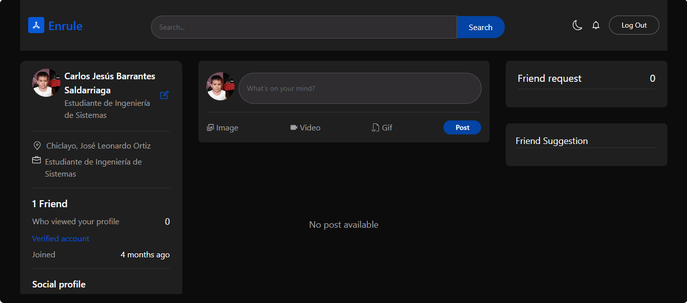
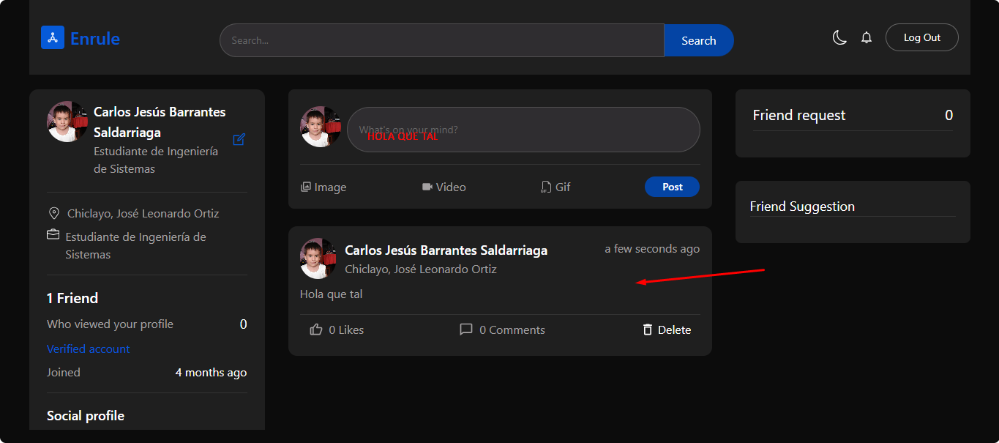
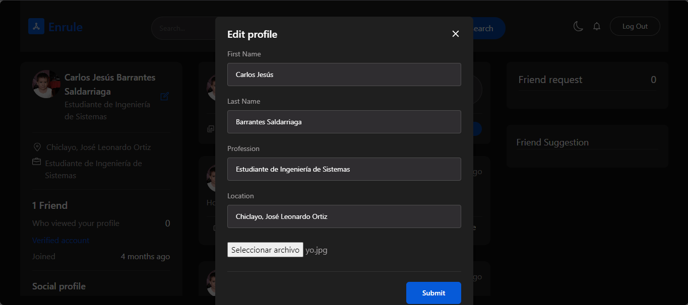
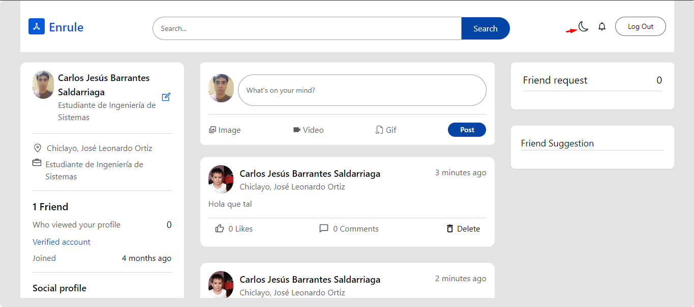
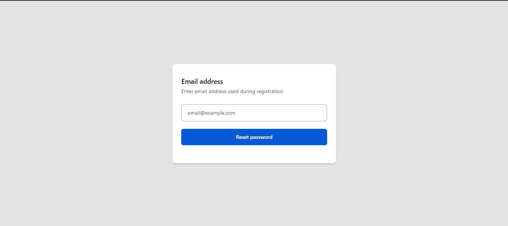
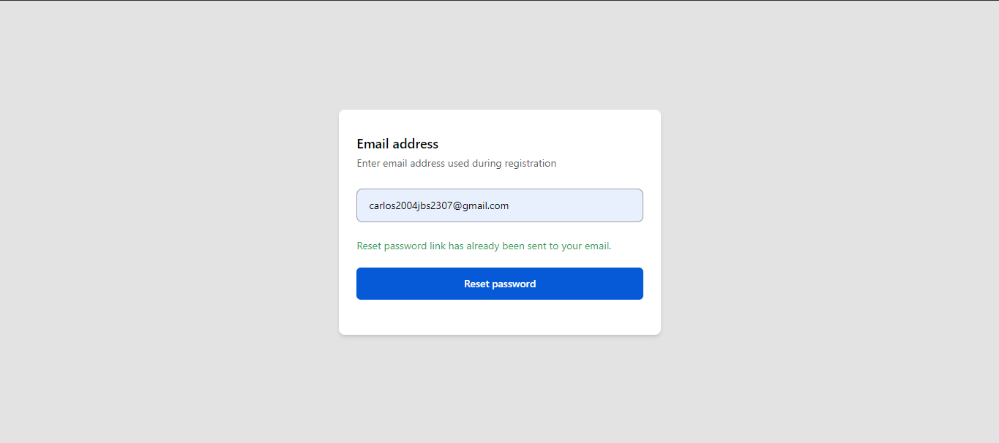

# Enrule - Red Social Minimalista

Enrule es una aplicación web de red social creada como parte de mi aprendizaje, basada en un tutorial disponible en [YouTube](https://youtu.be/EeeX_tvBAKk?si=XTXAOKdTjiOiqdMr). Aunque gran parte del proyecto sigue el diseño y funcionalidades originales del tutorial, he realizado algunos cambios y mejoras, especialmente en el backend y en el uso de TypeScript en el frontend.

## Características Principales

### Backend

- **Framework:** Express.js
- **Base de Datos:** MongoDB Atlas
- **Librerías utilizadas:**
  - `express`
  - `zod` para la validación de datos
  - `cloudinary` para la gestión de imágenes
  - `mongoose` para la conexión y manipulación de la base de datos
  - `jsonwebtoken` para la autenticación
  - `nodemailer` para la verificación de correo y restablecimiento de contraseñas
- **Estructura:**
  - `routes`: Define las rutas de la API
  - `controllers`: Contiene la lógica de las rutas
  - `middlewares`: Gestión de errores personalizados y otras funcionalidades
- **Autenticación:**
  - Por nombre de usuario y contraseña
  - Uso de JWT almacenados en el localStorage
- **Otras funcionalidades:**
  - Verificación de correo
  - Restablecimiento de contraseñas

#### Cambios realizados en el backend:

- Creación de un middleware de manejo de errores personalizado.
- Función para retornar respuestas al frontend de forma uniforme con una estructura JSON estándar.

### Frontend

- **Framework:** React con TypeScript
- **Librerías utilizadas:**
  - `redux-toolkit` para la gestión del estado
  - `axios` para la comunicación con la API
  - `react-router-dom` para el manejo de rutas
  - `tailwindcss` para el diseño
- **Diseño:**
  - Responsive y funcional en dispositivos móviles, tabletas, laptops y PCs
  - Diseño basado en el tutorial original
- **Autenticación:** Uso de JWT almacenados en el localStorage
- **Hooks personalizados:** Pequeños hooks para mejorar la reutilización de lógica

## Cómo ejecutar el proyecto

### Prerrequisitos

- Node.js v16+
- MongoDB Atlas (o una instancia local de MongoDB)
- Cloudinary para la gestión de imágenes

### Instalación

1. Clona el repositorio:

   ```bash
   git clone https://github.com/tuusuario/enrule.git
   cd enrule
   ```

2. Configura las variables de entorno:
   Crea un archivo `.env` en la carpeta del backend con los siguientes valores:

   ```env
   MONGODB_URI=tu_uri_de_mongodb_atlas
   JWT_SECRET=tu_secreto_jwt
   AUTH_EMAIL=tu_correo_electronico
   AUTH_PASSWORD=tu_contraseña_correo
   APP_URL=dirección_de_tu_aplicación
   CLOUD_NAME=tu_nombre_cloudinary
   CLOUD_API_KEY=tu_api_key_cloudinary
   CLOUD_API_SECRET=tu_api_secret_cloudinary
   ```

3. Instala las dependencias:

   - Backend:
     ```bash
     cd server
     npm install
     ```
   - Frontend:
     ```bash
     cd client
     npm install
     ```

4. Inicia el proyecto:

   - Backend:
     ```bash
     npm run dev
     ```
   - Frontend:
     ```bash
     npm start
     ```

5. Accede a la aplicación en tu navegador en `http://localhost:3000`.

## Capturas de pantalla

### Login



### Pantalla principal



### Creación de publicación

- Solo se puede añadir imágenes



### Editar perfil



### Modo dark y light



### Resetear contraseña





## Créditos

Este proyecto está basado en el tutorial de [YouTube](https://youtu.be/EeeX_tvBAKk?si=XTXAOKdTjiOiqdMr). Agradezco al autor original por compartir sus conocimientos y proporcionar una base sólida para este proyecto.

## Licencia

Este proyecto es solo para fines educativos. No está diseñado para su uso en producción.
